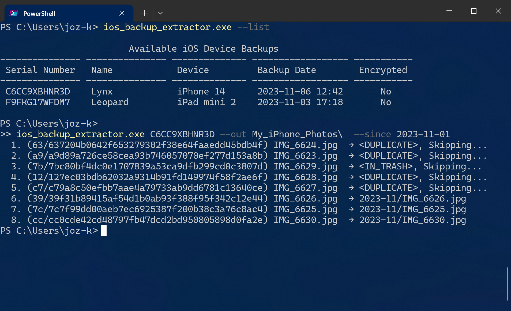
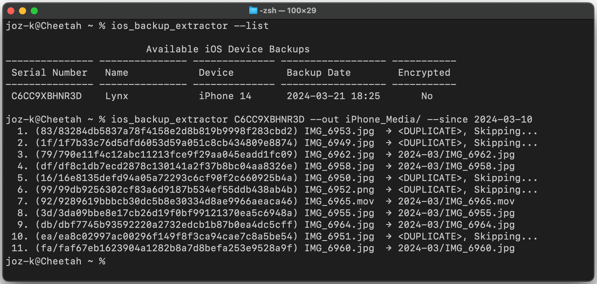

iOS Backup Extractor
====================

`ios_backup_extractor` is a command line utility to extract media files (photos and videos)
from a local _unencrypted_ iOS device backup. This type of backup is typically created by Apple's [iTunes][itunes-url]
or "[Apple Devices][apple-devices-url]" application on Windows OS or the built-in Finder application on MacOS[^1].

[^1]: Follow instructions from Apple's [iPhone User Guide](https://support.apple.com/guide/iphone/back-up-iphone-iph3ecf67d29/ios).

[itunes-url]: https://apps.microsoft.com/detail/9pb2mz1zmb1s
[apple-devices-url]: https://apps.microsoft.com/detail/9np83lwlpz9k

Download
---------

* Windows x64: [iOS_Backup_Extractor-v1.2.4_x64-windows.exe.zip](https://github.com/joz-k/ios_backup_extractor/releases/download/v1.2.4/iOS_Backup_Extractor-v1.2.4_x64-windows.exe.zip)
* MacOS arm64: [iOS_Backup_Extractor-v1.2.4_arm64-macos.zip](https://github.com/joz-k/ios_backup_extractor/releases/download/v1.2.4/iOS_Backup_Extractor_v1.2.4_arm64-macos.zip)
* MacOS intel64: [iOS_Backup_Extractor-v1.2.4_intel64-macos.zip](https://github.com/joz-k/ios_backup_extractor/releases/download/v1.2.4/iOS_Backup_Extractor-v1.2.4_intel64-macos.zip)
* Linux x64: [iOS_Backup_Extractor-v1.2.4_x64_linux.tar.gz](https://github.com/joz-k/ios_backup_extractor/releases/download/v1.2.4/iOS_Backup_Extractor-v1.2.4_x64_linux.tar.gz)

> [!NOTE]
> Please refer to the "[Troubleshooting](#troubleshooting)" section if the provided binaries display error messages.

Screenshots
-----------




Motivation
----------

This tool is designed to use unencrypted local iOS backups as a reliable and incremental way to export photos and videos from iOS devices to your computer without relying on any cloud services. Frequent (even daily) iOS backups are very efficient because they are incremental (only new or changed files are added to the backup). And this tool is also completely incremental. It never moves or overwrites files that have already been exported to a given output directory. 

**Note**: An unencrypted iOS backup won't contain most sensitive information from your iOS device. For example, passwords, Wi-Fi settings, website and call history, and health data are never transferred[^2]. So they are not as insecure as you might think. However, it is important to back up your iOS device data only to a fully secured computer.

[^2]: https://support.apple.com/en-us/108353

Troubleshooting
---------------

**Problem:** I launched the command on MacOS and it shows the message "`ios_backup_extractor` cannot be opened because the developer cannot be verified."\
**Solution:** You need to add this command to security exceptions following these steps:
 1. In the Finder on your Mac, locate the app where it has been extracted (unzipped). 
 2. Control-click the `ios_backup_extractor` icon, then choose Open from the shortcut menu.
 3. Click Open. This opens the Terminal window, launches the application and saves a security exception for it.
 4. You can now run the tool from the command line as usual.

**Problem:** I run the tool on the MacOS and it says there are no iOS backups available or I see an error message
             about directory access.\
**Solution:** Go to Settings, `Security & Privacy` → `Full Disk Access` and enable "Full Disk Access" for your
              `Terminal` application.

**Problem:** When I run this tool, I get the error message like `Not a HASH reference at ios_backup_extractor.pl line 729`.\
**Solution:** There was a bug in an earlier version of this tool, that randomly caused this type of error on Windows.
              Please use at least version 1.2.2 and this problem should be fixed.

`--help` screen
---------------
```
‘ios_backup_extractor’ extracts media files from an unencrypted
local backup of the iOS device made by iTunes or “Apple Devices” application
for Windows or by iPhone/iPad backup to MacOS computer.

Usage:
  ios_backup_extractor.exe [OPTIONS] DEVICE_SERIAL_ID | DEVICE_BACKUP_DIR --out OUTPUT_DIR
  ios_backup_extractor.exe [OPTIONS] --list

Commands:
  <default>           Extract media files from device backup.
  -l, --list          List available iOS device backups.
      --list-long     Like '--list' but prints more details.

Options:
  -f, --format FORMAT Determines a directory structure created in the output
                        directory. Valid values are:
                        - ‘ym’  for subdirectories like YYYY-MM (default)
                        - ‘ymd’ for subdirectories like YYYY-MM-DD
                        - ‘flat’ no subdirectories
  -s, --since DATE    Extract and copy only files created since DATE.
                        DATE must be in format YYYY-MM-DD or one
                        of the following special keywords:
                        - ‘last-week’
                        - ‘last-month’
      --add-trash     Extract also items marked as deleted.
      --prepend-date  Prepend a media creation date to each exported filename.
                        Default format is YYYY-MM-DD.
      --prepend-date-separator SEPARATOR
                      Change the separator for '--prepend-date' format.
                        Possible values are:
                        - ‘dash’ (default)
                        - ‘underscore’
                        - ‘none’
  -d, --dry           Dry run, don't copy any files.
  -v, --verbose       Show more information while running.
  -h, --help          Display help.

Examples:
  List all available iOS backups to determine device serial numbers.

      ios_backup_extractor.exe --list

  Extract all media files for a device with the serial number 'ABC123ABC123'
  to 'My Photos and Videos' directory. Such directory must exists already.

      ios_backup_extractor.exe ABC123ABC123 -o "My Photos and Videos"

Version:
    1.2.4 (2024-11-13)
```

License
-------

© 2024  [joz-k](https://github.com/joz-k/), [Artistic License 2.0](http://www.perlfoundation.org/artistic_license_2_0)
